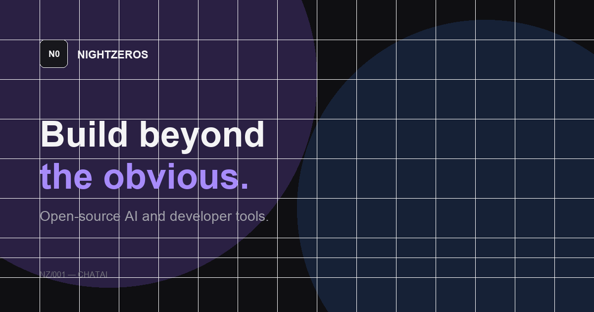

<p align="center">
  
</p>

<h1 align="center">NightZeros</h1>

<p align="center"><strong>Build beyond the obvious.</strong></p>

<p align="center">Independent studio building open-source AI and developer tools.</p>

<p align="center">
  <a href="https://nightszeros.com">Website</a>
  ·
  <a href="https://nightszeros.com/chatai">ChatAI</a>
  ·
  <a href="https://docs.nightzeros.com">Docs</a>
  ·
  <a href="https://github.com/nightzeros">GitHub</a>
  ·
  <a href="https://www.npmjs.com/org/nightzeros">npm</a>
</p>

<p align="center">
  
</p>

This repository is the source for [nightszeros.com](https://nightszeros.com) — the public studio site, project pages, and security posture.

## About

NightZeros is a product and engineering studio. We build tools we want to use ourselves, ship them as real software, and share them when they help other developers.

Zero is the starting point: an idea, an empty repository, a first line of code. NightZeros is about what gets built from there.

**Principles**

- Useful over flashy
- Open over opaque
- Simple over unnecessarily complicated
- Developer experience matters
- Security and privacy are product features
- Ship, learn, improve

## Flagship — NZ/001 ChatAI

**Your knowledge. Your AI. Anywhere.**

ChatAI is an open-source platform for building AI assistants grounded in your own knowledge and embedding them into websites and applications.

| | |
| --- | --- |
| Product | [nightszeros.com/chatai](https://nightszeros.com/chatai) |
| App | [app.nightzeros.com](https://app.nightzeros.com) |
| Docs | [docs.nightzeros.com](https://docs.nightzeros.com) |
| Source | [github.com/nightzeros/chatai](https://github.com/nightzeros/chatai) |

**Packages**

- [`@nightzeros/chatai-react`](https://www.npmjs.com/package/@nightzeros/chatai-react)
- [`@nightzeros/chatai-sdk`](https://www.npmjs.com/package/@nightzeros/chatai-sdk)
- [`@nightzeros/chatai-widget`](https://www.npmjs.com/package/@nightzeros/chatai-widget)
- [`@nightzeros/chatai-widget-core`](https://www.npmjs.com/package/@nightzeros/chatai-widget-core)

## Site map

| Path | Purpose |
| --- | --- |
| [`/`](https://nightszeros.com/) | Studio overview |
| [`/projects`](https://nightszeros.com/projects) | What NightZeros is building |
| [`/chatai`](https://nightszeros.com/chatai) | ChatAI product page |
| [`/open-source`](https://nightszeros.com/open-source) | Source, packages, contributing posture |
| [`/about`](https://nightszeros.com/about) | Mission, name, principles |
| [`/security`](https://nightszeros.com/security) | Disclosure and product security |

Also published from `public/`: [llms.txt](https://nightszeros.com/llms.txt), [sitemap](https://nightszeros.com/sitemap.xml), [robots.txt](https://nightszeros.com/robots.txt).

## Stack

TanStack Start, React 19, Tailwind CSS v4, Vite 7, Nitro SSR.

Dark-first UI: near-black surfaces, Geist / Geist Mono, restrained violet → azure accent. Brand tokens live in [`src/styles.css`](src/styles.css). Naming and usage are in [`BRAND.md`](BRAND.md).

## Local development

Requires Node.js 20+ and [pnpm](https://pnpm.io).

```bash
pnpm install
pnpm dev
```

The site runs at [http://localhost:3000](http://localhost:3000).

```bash
pnpm build
pnpm start
```

Copy [`.env.example`](.env.example) to `.env` if you need Google or Bing site verification meta tags. Do not commit `.env`.

## Docs in this repo

| File | |
| --- | --- |
| [BRAND.md](BRAND.md) | Name, mark, color, type, voice |
| [CONTRIBUTING.md](CONTRIBUTING.md) | How to work on the website |
| [SECURITY.md](SECURITY.md) | Vulnerability reporting |
| [CODE_OF_CONDUCT.md](CODE_OF_CONDUCT.md) | Community standards |
| [LICENSE](LICENSE) | MIT |

## License

MIT © NightZeros
